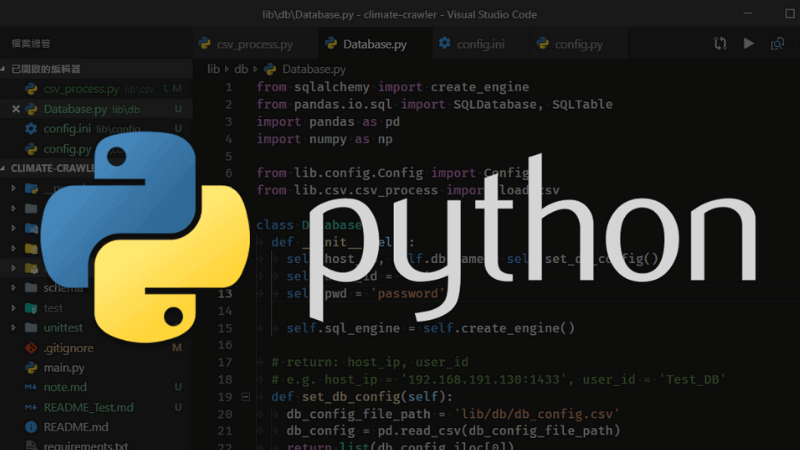
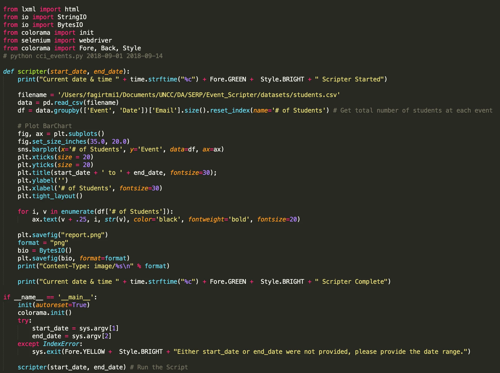
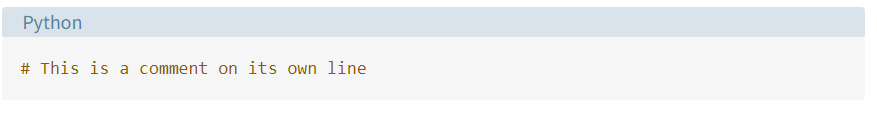

<!-- _backgroundColor: aquq -->

<!-- _color: red -->

<!-- paginate: false -->

## First Step to Python Programming

### Week-1 (How to Use Python: Your First Steps)

#### Spring Semester, 2022-2023

Download [DOC](week-1.en.md_doc.pdf), [SLIDE](week-1.en.md_slide.pdf), [PPTX](week-1.en.md_slide.pptx)

<iframe width=700, height=500 frameBorder=0 src="../week-1.en.md_slide.html"></iframe>

---

<!-- paginate: true -->

### Outline

- What Python is and why you should use it
- How to Download and Install Python
- The Basic Python Syntax

---

## **First Step to Python Programming**

---

### First Step to Python Programming

- **Why You Should Use Python**
Python, named after the British comedy group Monty Python, is a high-level, interpreted, interactive, and object-oriented programming language. Its flexibility allows you to do many things, both big and small. With Python, you can write basic programs and scripts and also to create complex and large-scale enterprise solutions
  - You can find Python everywhere in the world of computer programming. For example, Python is the foundation of some of the world’s most popular websites, including Reddit, Dropbox, and YouTube, to name a few. The Python web framework Django powers both Instagram and Pinterest. 

---

- **Compared to other programming languages, Python has the following features:**

Interpreted: It’s portable and quicker to experiment with than compiled languages.
Multiparadigm: It lets you write code in different styles, including object-oriented, imperative, and functional style.
Dynamically typed: It checks variable types at runtime, so you don’t need to declare them explicitly.
Strongly typed: It won’t let unsafe operations on incompatible types go unnoticed.

.jpg)

---
There’s a lot more to learn about Python. But by now, you should have a better idea of why Python is so popular and why you should consider learning to program with it.

- **How to Download and Install Python:**
Python works on Linux, Mac, Windows, and several other platforms. It comes preinstalled on macOS and on most Linux distributions. However, if you want to be up to date, then you probably need to download and install the latest version. 

---

**To check what Python version has been installed globally in your operating system, open the terminal or command line and run the following command:**
This command prints the version of your system’s default Python 3 installation. Note that you use python3 instead of python because some operating systems still include Python 2 as their default Python installation.

---

---

- **The Basic Python Syntax:**
The Python syntax is clear, concise, and focused on readability. Readability is arguably one of the more attractive features of the language itself. It makes Python ideal for people who are learning to program. In this section, you’ll learn about several important components of the Python syntax:

---

- **COMMENTS:**
Comments are pieces of text that live in your code but are ignored by the Python interpreter as it executes the code. You can use comments to describe the code so that you and other developers can quickly understand what the code does or why the code is written in a given way. To write a comment in Python, just add a hash mark (#) before your comment text:

---

**SEE YOU NEXT LESSON :)**

--- 

## References

- https://realpython.com/python-first-steps/#the-basic-python-syntax
- https://www.techinside.com/en-populer-programlama-dili-python-oldu/
- https://www.abakuskitap.com/blog/icerik/python-ile-ne-yapabilirsiniz-pythonin-3-temel-kullanim-alani
- https://www.fiverr.com/fatihagirtmis/do-python-programming-for-you

---

$End-Of-Week-1-Module$
