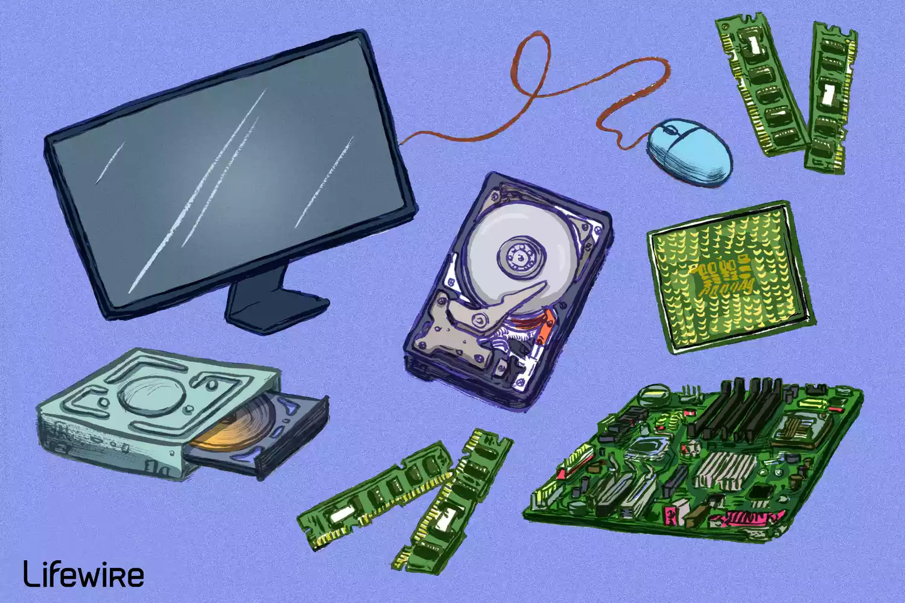
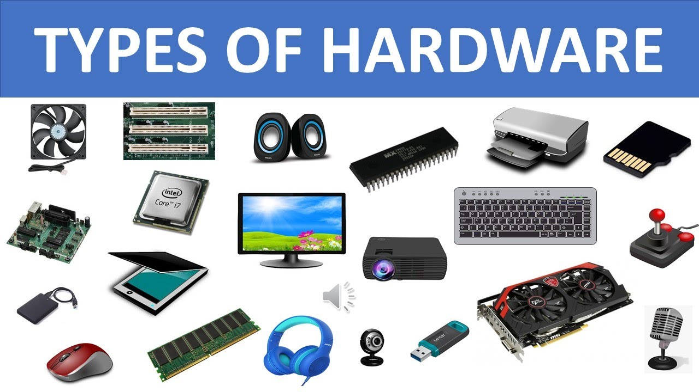
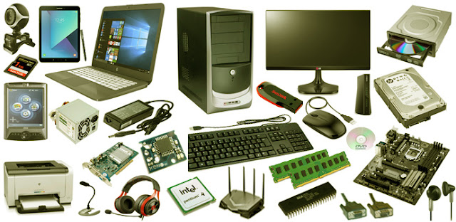
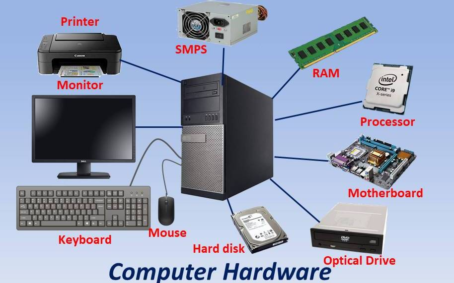
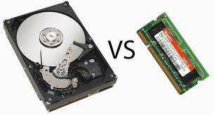

<!-- _backgroundColor: aquq -->

<!-- _color: orange -->

<!-- paginate: false -->

## Computer Hardware

### Week-2 (Computer Hardware)

#### Spring Semester, 2022-2023

Download [DOC](week-2.en.md_doc.pdf), [SLIDE](week-2.en.md_slide.pdf), [PPTX](week-2.en.md_slide.pptx)

<iframe width=700, height=500 frameBorder=0 src="../week-2.en.md_slide.html"></iframe>

---

<!-- paginate: true -->

### Outline

- List of Computer Hardware
- Troubleshooting Faulty Computer Hardware
- Hardware vs. Software

---

## **Introduction to Computer Hardware**

---

### Computer Hardware

- Computer hardware refers to the physical components that make up a computer system.

There are many different kinds of hardware that can be installed inside, and connected to the outside, of a computer.

Computer hardware may sometimes be seen abbreviated as computer hw. 

---

- List of Computer Hardware:
Here are some common individual computer hardware components that you'll often find inside a modern computer. These parts are almost always found inside the computer case, so you won't see them unless you open the computer:

Motherboard, Central Processing Unit (CPU), Random Access, Memory (RAM), Power Supply Unit (PSU), Video card ,Hard Disk, Drive (HDD), Solid-State Drive (SSD), Optical disk drive (e.g., BD/DVD/CD drive), Card reader (SD/SDHC, CF, etc.)

---

- Common hardware that you might find connected to the outside of a computer, although many tablets, laptops, and netbooks integrate some of these items into their housings:

Monitor
Keyboard
Mouse
Uninterruptible Power Supply (UPS)
Flash drive
Printer
Speakers
External hard drive
Pen tablet

---

- Less common individual computer hardware devices, either because these pieces are now usually integrated into other devices or because they've been replaced with newer technology:

Sound card, Network Interface Card (NIC), Expansion card (FireWire, USB, etc.), Hard drive controller card, Analog modem, Scanner, Projector, Floppy disk drive, Joystick, Webcam, Microphone, Tape drive, Zip drive

---

---

- **Troubleshooting Faulty Computer Hardware:**
Computer hardware components individually heat up and cool down as they're used and then not used, meaning that eventually, every single one will fail. Some may even fail at the same time. Fortunately, at least with desktop computers and some laptop and tablet computers, you can replace the non-working piece of hardware without having to replace or rebuild the computer from scratch. 

---

- **Hardware vs. Software**
A computer system isn't complete unless there's also software, which is different than hardware. The software is data that's stored electronically, like an operating system or a video editing tool, which runs on the hardware. Hardware gets its name due to the fact that it's strict when it comes to modifications, whereas software is more flexible (i.e., you can easily upgrade or change software). Firmware is closely related to hardware and software, too...

.jfif)

---

###  SEE YOU NEXT LESSON :)
--- 

## References

- https://www.lifewire.com/computer-hardware-2625895
- https://www.youtube.com/watch?v=SSnNY8GfZig
- https://mycomputernotes.com/what-is-computer-hardware/

---

$End-Of-Week-2-Module$
