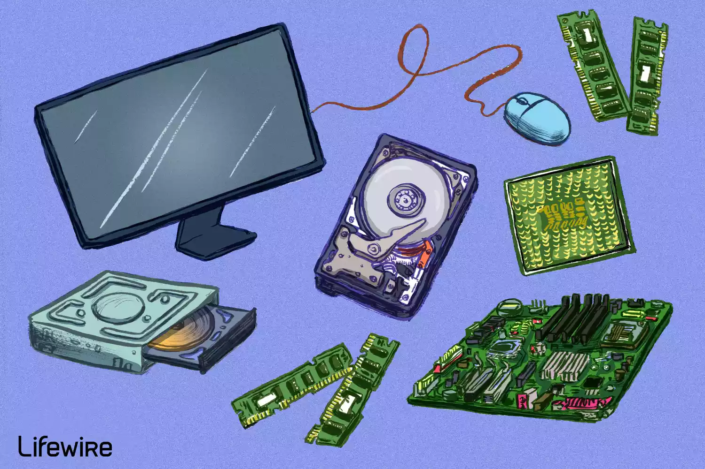
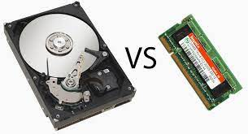

<!-- _backgroundColor: aquq -->

<!-- _color: orange -->

<!-- paginate: false -->

## Örnek Ders Adı

### Hafta-2 (Örnek Ders Modülü Adı)

#### Bahar Dönemi, 20XX-20XX

İndir [DOC](week-2.tr.md_doc.pdf), [SLIDE](week-2.tr.md_slide.pdf), [PPTX](week-2.tr.md_slide.pptx)

<iframe width=700, height=500 frameBorder=0 src="../week-2.tr.md_slide.html"></iframe>

---

<!-- paginate: true -->

### Anahat

- Bilgisayar Donanımı Listesi
- Arızalı Bilgisayar Donanımında Sorun Giderme
- Donanım ve Yazılım

---

## **Bilgisayar Donanımına Giriş**

---

 ### Bilgisayar donanımı

- Bilgisayar donanımı, bir bilgisayar sistemini oluşturan fiziksel bileşenleri ifade eder.

Bir bilgisayarın içine kurulabilen ve dışına bağlanabilen birçok farklı donanım türü vardır.

Bilgisayar donanımı bazen bilgisayar hw olarak kısaltılmış olarak görülebilir.

---

- Bilgisayar Donanımı Listesi:
Modern bir bilgisayarın içinde sıklıkla bulacağınız bazı yaygın bireysel bilgisayar donanımı bileşenleri aşağıda verilmiştir. Bu parçalar neredeyse her zaman bilgisayar kasasının içinde bulunur, bu nedenle bilgisayarı açmadığınız sürece bunları göremezsiniz: Anakart, Merkezi İşlem Birimi (CPU), Rastgele Erişim, Bellek (RAM), Güç Kaynağı Birimi (PSU), Ekran kartı, Sabit Disk, Sürücü (HDD), Katı Hal Sürücüsü (SSD), Optik disk sürücüsü (ör. BD /DVD/CD sürücüsü), Kart okuyucu (SD/SDHC, CF)

---

- Birçok tablet, dizüstü bilgisayar ve netbook bu öğelerin bazılarını muhafazalarına entegre etmesine rağmen, bilgisayarın dışına bağlı bulabileceğiniz ortak donanım:

monitör
Tuş takımı
Fare
Kesintisiz Güç Kaynağı (UPS)
Flaş sürücü
Yazıcı
Hoparlörler
Harici disk
Kalem tableti

---

- Daha az yaygın olan bireysel bilgisayar donanım aygıtları, bu parçalar artık genellikle diğer aygıtlara entegre edildiğinden veya daha yeni teknolojilerle değiştirildiğinden:

Ses kartı, Ağ Arabirim Kartı (NIC), Genişletme kartı (FireWire, USB, vb.), Sabit sürücü denetleyici kartı, Analog modem, Tarayıcı, Projektör, Disket sürücü, Joystick, Web kamerası, Mikrofon, Teyp sürücüsü, Zip sürücüsü

---

---

- **Arızalı Bilgisayar Donanımında Sorun Giderme:**
Bilgisayar donanımı bileşenleri, kullanıldıkça ve kullanılmadıkça ayrı ayrı ısınır ve soğur, bu da eninde sonunda her birinin arızalanacağı anlamına gelir. Hatta bazıları aynı anda başarısız olabilir. Neyse ki, en azından masaüstü bilgisayarlar ve bazı dizüstü ve tablet bilgisayarlarda, çalışmayan donanım parçasını bilgisayarı sıfırdan değiştirmek veya yeniden oluşturmak zorunda kalmadan değiştirebilirsiniz.

---

- **Donanım ve Yazılım**
Donanımdan farklı bir yazılım da olmadıkça bir bilgisayar sistemi tam değildir. Yazılım, bir işletim sistemi veya donanım üzerinde çalışan bir video düzenleme aracı gibi elektronik olarak depolanan verilerdir. Donanım adını, söz konusu değişiklik olduğunda katı olduğu gerçeğinden alır, oysa yazılım daha esnektir (yani, yazılımı kolayca yükseltebilir veya değiştirebilirsiniz). Firmware de donanım ve yazılımla yakından ilgilidir... 

.jfif)

---

BİR SONRAKİ DERSTE GÖRÜŞMEK ÜZERE :)

--- 

## Referanslar

- https://www.lifewire.com/computer-hardware-2625895
- https://www.youtube.com/watch?v=SSnNY8GfZig
- https://mycomputernotes.com/what-is-computer-hardware/

---

$Hafta-2-Son$
